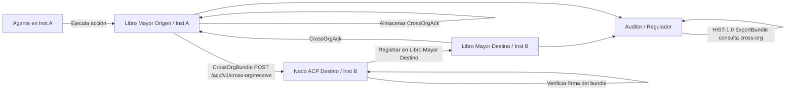

# ACP-CROSS-ORG-1.0 — Registro de Interacciones Cross-Organizacionales

**Versión:** 1.0
**Estado:** Activo
**Dependencias:** ACP-LEDGER-1.2, ACP-ITA-1.1, ACP-HIST-1.0, ACP-LIA-1.0, ACP-SIGN-1.0
**Implementa:** ACP-CONF-1.1 Nivel de Conformidad L4
**Relacionado:** ACP-REP-PORTABILITY-1.0

---

## Resumen

ACP-CROSS-ORG-1.0 define el tipo de evento `CROSS_ORG_INTERACTION`, convirtiendo las interacciones entre sistemas de distintas organizaciones en una entidad de primer nivel y auditabilidad completa dentro del libro mayor ACP. Antes de esta especificación, las acciones inter-institucionales quedaban implícitas en eventos `AUTHORIZATION` y `LIABILITY_RECORD`, pero no existía un registro unificado y consultable de la interacción como evento bilateral. Esta especificación cierra ese vacío.

Un evento `CROSS_ORG_INTERACTION` registra el momento en que se cruza una frontera de confianza institucional: cuando un agente autorizado bajo una institución ejecuta una acción que produce efectos observables en, o está dirigida hacia, una segunda institución. Es la unidad atómica de auditabilidad cross-sistema.

---

## 1. Alcance

Este documento define:

- El tipo de evento `CROSS_ORG_INTERACTION` y el esquema de su payload
- Las reglas de emisión: quién emite, cuándo y bajo qué condiciones
- El protocolo de verificación bilateral: cómo la institución destino valida una interacción entrante
- Las extensiones de consulta y exportación sobre ACP-HIST-1.0 para filtrado cross-org
- Requisitos de conformidad

Este documento **no** define:
- Cómo se establece la federación entre instituciones (ver ACP-ITA-1.1)
- Cómo se actualiza la reputación a partir de eventos cross-org (ver ACP-REP-PORTABILITY-1.0)
- Flujos de pago entre instituciones (ver ACP-PAY-1.0)

---

## 2. Terminología

**CROSS_ORG_INTERACTION:** Evento del libro mayor ACP emitido cuando un agente de la institución origen ejecuta una acción dirigida a, o que produce efectos verificables en, la institución destino.

**CrossOrgBundle:** Paquete firmado y auto-verificable que contiene uno o más eventos `CROSS_ORG_INTERACTION`, diseñado para ser transmitido a la institución destino y almacenado en su libro mayor.

**CrossOrgAck:** Confirmación firmada de la institución destino que acredita la recepción y validación de un CrossOrgBundle. Se almacena en ambos libros mayores.

**ActionType:** Enumeración de categorías de acciones cross-organizacionales. Extensible; las instituciones pueden definir subtipos específicos de dominio con el prefijo `x:`.

**PayloadHash:** Hash SHA-256 de la representación canónica (JCS, RFC 8785) del payload de la interacción. El payload en sí nunca se transmite — solo el hash.

**ZKP:** Zero-knowledge proof (prueba de conocimiento cero), campo opcional. Permite a la institución origen demostrar una propiedad de la interacción (p. ej., "el monto transferido está dentro de los límites regulatorios") sin revelar el payload completo.

---

## 3. Motivación

El modelo de autorización ACP es institucional: cada institución mantiene su propio libro mayor, sus propios agentes y su propia evaluación de riesgos. Cuando dos instituciones interactúan, el modelo existente captura:

- El `AUTHORIZATION` en el lado origen (libro mayor origen)
- El `LIABILITY_RECORD` en el lado origen (libro mayor origen)
- Nada en el lado destino a menos que genere eventos de forma independiente

Esto crea un **rastro de auditoría asimétrico**: la institución origen tiene un registro completo, el destino no tiene nada a menos que implemente instrumentación propia. Los auditores externos y reguladores no pueden reconstruir el flujo cross-institucional completo desde un único libro mayor.

`CROSS_ORG_INTERACTION` cierra este vacío mediante:

1. Hacer la interacción explícita en **ambos** libros mayores
2. Proporcionar un protocolo de verificación bilateral **estandarizado**
3. Crear un **endpoint de consulta de primer nivel** para eventos cross-org
4. Habilitar que los sistemas de reputación y responsabilidad descarguen una señal limpia

---

## 4. Tipo de Evento: `CROSS_ORG_INTERACTION`

### 4.1 Envelope

El evento sigue el envelope estándar de ACP-LEDGER-1.2:

```json
{
  "ver": "1.2",
  "event_id": "<uuid_v4>",
  "event_type": "CROSS_ORG_INTERACTION",
  "sequence": 42,
  "timestamp": "<unix_timestamp_ms>",
  "institution_id": "<source_institution_id>",
  "prev_hash": "<sha256_of_previous_event_canonical>",
  "payload": { ... },
  "sig": "<ed25519_base64url_over_canonical_envelope>"
}
```

El `institution_id` en el envelope es **siempre la institución origen** — la institución cuyo agente inició la interacción. La institución destino almacena este evento en su propio libro mayor con su propio envelope envolviendo el CrossOrgBundle (ver §7).

### 4.2 Esquema del Payload

```json
{
  "event_id": "e7f9c8a1-5b2c-4d3e-987f-1234567890ab",
  "timestamp": "2026-03-11T12:00:00Z",
  "source_institution_id": "INST-A",
  "target_institution_id": "INST-B",
  "action_type": "DATA_SHARE",
  "payload_hash": "a1b2c3d4e5f6a1b2c3d4e5f6a1b2c3d4e5f6a1b2c3d4e5f6a1b2c3d4e5f6a1b2",
  "delegation_chain": [
    {
      "agent_id": "AGT-001",
      "institution_id": "INST-A",
      "capability": "acp:cap:data.share",
      "sig": "base64url(ed25519_sig_over_delegation_step)"
    }
  ],
  "authorization_id": "<uuid_of_AUTHORIZATION_event_in_source_ledger>",
  "liability_record_id": "<uuid_of_LIABILITY_RECORD_in_source_ledger>",
  "proof": "zkp_base64url_encoded_optional_or_null",
  "ack_required": true,
  "metadata": {
    "protocol_version": "1.0",
    "domain": "finance",
    "classification": "confidential"
  }
}
```

### 4.3 Definición de Campos

| Campo | Tipo | Requerido | Descripción |
|-------|------|-----------|-------------|
| `event_id` | string (UUID v4) | ✓ | Identificador de evento globalmente único. Clave primaria para referencias cruzadas. |
| `timestamp` | string (ISO 8601) | ✓ | Timestamp UTC del inicio de la interacción. |
| `source_institution_id` | string | ✓ | ID institucional ACP de la institución iniciadora. DEBE coincidir con el `institution_id` del envelope. |
| `target_institution_id` | string | ✓ | ID institucional ACP de la institución receptora. DEBE estar registrada en la federación ITA (ACP-ITA-1.1). |
| `action_type` | string (enum) | ✓ | Categoría de acción cross-org. Ver §4.4. |
| `payload_hash` | string (hex, 64 chars) | ✓ | SHA-256 del payload de interacción en forma canónica JCS. El payload en sí nunca se transmite. |
| `delegation_chain` | array | ✓ | Lista ordenada de pasos de delegación desde la capacidad raíz hasta el agente actuante. Mínimo 1 entrada. |
| `authorization_id` | string (UUID) | ✓ | UUID del evento `AUTHORIZATION` en el libro mayor **origen** que autorizó esta interacción. DEBE ser verificable. |
| `liability_record_id` | string (UUID) | ✓ | UUID del evento `LIABILITY_RECORD` en el libro mayor **origen**. DEBE emitirse antes o en la misma secuencia que este evento. |
| `proof` | string \| null | ○ | ZK-proof opcional. Formato: `zkp:<scheme>:<base64url_data>`. Cuando está presente, la institución destino PUEDE usarlo para verificación de cumplimiento sin acceder al payload. |
| `ack_required` | boolean | ✓ | Cuando es `true`, la institución destino DEBE emitir un `CrossOrgAck` y transmitirlo de vuelta. |
| `metadata` | object | ○ | Metadatos específicos de dominio. Claves reservadas: `protocol_version`, `domain`, `classification`. |

### 4.4 Enumeración ActionType

| ActionType | Descripción |
|-----------|-------------|
| `DATA_SHARE` | Origen comparte datos (dataset, reporte, stream) con destino. |
| `SERVICE_INVOCATION` | Agente origen invoca un endpoint de servicio en destino. |
| `DELEGATION_TRANSFER` | Origen transfiere una delegación de capacidad a un agente en destino. |
| `COMPLIANCE_QUERY` | Origen consulta estado regulatorio/de cumplimiento en destino. |
| `FINANCIAL_SETTLEMENT` | Origen inicia una liquidación financiera dirigida a destino. Requiere ACP-PAY-1.0. |
| `AUDIT_REQUEST` | Origen solicita un segmento de auditoría (ExportBundle) a destino. |
| `REPUTATION_QUERY` | Origen consulta datos de reputación de agente en destino. Ver ACP-REP-PORTABILITY-1.0. |
| `x:<custom>` | Definido por institución. DEBE llevar prefijo `x:` para evitar colisiones con tipos reservados. |

---

## 5. Reglas de Emisión

**CROSS-RULE-1:** Un evento `CROSS_ORG_INTERACTION` DEBE ser emitido por la **institución origen** en su propio libro mayor por cada acción que cruce una frontera de confianza institucional, según lo define la federación activa (ACP-ITA-1.1).

**CROSS-RULE-2:** El evento DEBE emitirse **después** del `LIABILITY_RECORD` para la misma ejecución. El campo `liability_record_id` DEBE referenciar un evento que ya existe en el libro mayor origen.

**CROSS-RULE-3:** El `authorization_id` DEBE referenciar un evento `AUTHORIZATION` que precedió esta interacción en el libro mayor origen. Si el evento `AUTHORIZATION` no puede encontrarse, la emisión está prohibida y la interacción DEBE ser bloqueada.

**CROSS-RULE-4:** El `payload_hash` DEBE calcularse sobre la forma canónica JCS del payload de interacción completo antes de la transmisión. No se actualiza tras la emisión.

**CROSS-RULE-5:** Si `ack_required` es `true`, la institución origen DEBE rastrear el acuse pendiente y escalar vía `ESCALATION_CREATED` si no se recibe ningún `CrossOrgAck` dentro del timeout configurado (predeterminado: 300s).

**CROSS-RULE-6:** Si no existe una federación entre `source_institution_id` y `target_institution_id` (verificado vía `GET /ita/v1/federation/resolve/{target_institution_id}`), el evento NO DEBE emitirse y DEBE devolver el error CROSS-004.

---

## 6. Ejemplo Completo

### 6.1 Interacción: Institución A comparte un reporte de datos con Institución B

**Secuencia en el libro mayor origen (INST-A):**

```
seq 38: AUTHORIZATION    → auth_id: "auth-9a3f..."
seq 39: EXECUTION_TOKEN_CONSUMED → et_id: "et-7c2b..."
seq 40: LIABILITY_RECORD  → lia_id: "lia-5d1e..."
seq 41: CROSS_ORG_INTERACTION → event_id: "e7f9c8a1..."
```

**Evento CROSS_ORG_INTERACTION completo (seq 41):**

```json
{
  "ver": "1.2",
  "event_id": "e7f9c8a1-5b2c-4d3e-987f-1234567890ab",
  "event_type": "CROSS_ORG_INTERACTION",
  "sequence": 41,
  "timestamp": 1741694400000,
  "institution_id": "INST-A",
  "prev_hash": "9f3bc2a1e4d7890123456789abcdef0123456789abcdef0123456789abcdef01",
  "payload": {
    "event_id": "e7f9c8a1-5b2c-4d3e-987f-1234567890ab",
    "timestamp": "2026-03-11T12:00:00Z",
    "source_institution_id": "INST-A",
    "target_institution_id": "INST-B",
    "action_type": "DATA_SHARE",
    "payload_hash": "a1b2c3d4e5f6a1b2c3d4e5f6a1b2c3d4e5f6a1b2c3d4e5f6a1b2c3d4e5f6a1b2",
    "delegation_chain": [
      {
        "agent_id": "AGT-001",
        "institution_id": "INST-A",
        "capability": "acp:cap:data.share",
        "sig": "base64url_sig_AGT001_over_delegation_step"
      }
    ],
    "authorization_id": "auth-9a3f-4b2c-8d1e-567890abcdef",
    "liability_record_id": "lia-5d1e-4c3b-9a2f-890123abcdef",
    "proof": null,
    "ack_required": true,
    "metadata": {
      "protocol_version": "1.0",
      "domain": "finance",
      "classification": "confidential"
    }
  },
  "sig": "base64url_ed25519_sig_INST_A_over_canonical_event"
}
```

---

## 7. CrossOrgBundle — Protocolo de Transmisión Bilateral

### 7.1 Estructura del bundle

Tras emitir el evento en el libro mayor origen, la institución origen lo empaqueta para transmitirlo al destino:

```json
{
  "bundle_id": "<uuid_v4>",
  "bundle_version": "1.0",
  "source_institution_id": "INST-A",
  "target_institution_id": "INST-B",
  "created_at": "2026-03-11T12:00:01Z",
  "events": [
    { "<full CROSS_ORG_INTERACTION event as above>" }
  ],
  "evidence": {
    "authorization_export": "<ExportBundle de HIST-1.0 filtrado a auth_id>",
    "liability_export": "<ExportBundle de HIST-1.0 filtrado a lia_id>"
  },
  "sig": "base64url_ed25519_sig_INST_A_over_canonical_bundle"
}
```

El bloque `evidence` es opcional pero RECOMENDADO. Contiene ExportBundles de HIST-1.0 que permiten al destino verificar independientemente los eventos del libro mayor origen sin consultar la API del origen.

### 7.2 Endpoint de transmisión

La institución origen hace POST del bundle al nodo ACP del destino:

```
POST /acp/v1/cross-org/receive
Content-Type: application/json

Body: <CrossOrgBundle>
```

### 7.3 Pasos de validación del destino

Al recibir un CrossOrgBundle, la institución destino DEBE:

1. **Verificar federación:** `GET /ita/v1/federation/resolve/{source_institution_id}` — confirmar que existe federación activa.
2. **Verificar firma del bundle:** validar `sig` contra el ARK de la institución origen (obtenido vía federación ITA).
3. **Verificar firma de cada evento:** validar la `sig` de cada evento usando el ARK de la institución origen.
4. **Verificar integridad de la cadena de hashes:** si el bundle contiene múltiples eventos, verificar el encadenamiento secuencial de `prev_hash`.
5. **Verificar referencias (opcional):** si `evidence.authorization_export` está presente, verificar integridad del ExportBundle según HIST-1.0 §7.
6. **Comprobar idempotencia:** si `event_id` ya existe en el libro mayor local, devolver 200 OK (ya procesado) sin duplicar.
7. **Registrar en libro mayor local:** emitir un evento `CROSS_ORG_INTERACTION` en el libro mayor propio del destino con `institution_id` = ID de la institución destino y una referencia al `event_id` original.

### 7.4 CrossOrgAck

Si `ack_required` es `true`, la institución destino DEBE responder con:

```json
{
  "ack_id": "<uuid_v4>",
  "original_event_id": "e7f9c8a1-5b2c-4d3e-987f-1234567890ab",
  "target_institution_id": "INST-B",
  "source_institution_id": "INST-A",
  "validated_at": "2026-03-11T12:00:02Z",
  "status": "accepted",
  "ledger_sequence": 17,
  "sig": "base64url_ed25519_sig_INST_B_over_canonical_ack"
}
```

Valores de `status`: `accepted` | `rejected` (con `rejection_reason`) | `pending_review`.

La institución origen DEBE almacenar el `CrossOrgAck` en su propio libro mayor como un evento `CROSS_ORG_ACK` (subtipo de la familia CROSS_ORG_INTERACTION).

---

## 8. Flujo de Interacción



---

## 9. Extensiones de Consulta (HIST-1.0)

Esta especificación agrega un parámetro de filtro cross-org al endpoint existente `GET /acp/v1/audit/query` definido en ACP-HIST-1.0:

### Nuevos parámetros de filtro

| Parámetro | Tipo | Descripción |
|-----------|------|-------------|
| `event_type` | string | Establecer a `CROSS_ORG_INTERACTION` para filtrar exclusivamente. |
| `source_institution_id` | string | Filtrar por institución origen. |
| `target_institution_id` | string | Filtrar por institución destino. |
| `action_type` | string | Filtrar por enum de tipo de acción (§4.4). |
| `cross_org_status` | string | `acked` / `pending_ack` / `rejected` |

### Extensión de historial cross-org de agente

```
GET /acp/v1/audit/agents/{agent_id}/cross-org-history
```

Devuelve todos los eventos `CROSS_ORG_INTERACTION` en los que el agente participó en `delegation_chain`, desde perspectivas tanto de origen como de destino.

**Respuesta:**
```json
{
  "agent_id": "AGT-001",
  "cross_org_summary": {
    "total_interactions": 47,
    "as_source": 31,
    "as_target": 16,
    "action_types": {
      "DATA_SHARE": 22,
      "SERVICE_INVOCATION": 15,
      "COMPLIANCE_QUERY": 10
    },
    "institutions_interacted": ["INST-B", "INST-C", "INST-D"]
  },
  "events": [ "..." ]
}
```

### Exportación cross-org

```
POST /acp/v1/audit/export
```

Con body que incluya `event_types: ["CROSS_ORG_INTERACTION", "CROSS_ORG_ACK"]` y filtro opcional `target_institution_id`. El ExportBundle resultante es verificable independientemente según HIST-1.0 §7.

---

## 10. Referencia de Integración

| Spec | Punto de Integración |
|------|---------------------|
| **ACP-LEDGER-1.2** | `CROSS_ORG_INTERACTION` es un tipo de evento extendido en la taxonomía de eventos LEDGER-1.2. Sigue el mismo formato de envelope, encadenamiento de hashes y reglas de firma. Un verificador LEDGER-1.2 v1.0 que encuentre este tipo DEBE aplicar la regla LEDGER-008 (tipo desconocido, continuar verificando cadena). |
| **ACP-ITA-1.1** | La resolución de federación es prerrequisito para cada emisión (§5, CROSS-RULE-6). El ARK de ITA-1.1 se usa para la verificación de firma del bundle (§7.3 paso 2). |
| **ACP-HIST-1.0** | Las extensiones de consulta son aditivas sobre los endpoints existentes (§9). El formato ExportBundle de HIST-1.0 §7 se reutiliza para evidencia en CrossOrgBundle (§7.1). |
| **ACP-LIA-1.0** | Cada `CROSS_ORG_INTERACTION` DEBE referenciar un `LIABILITY_RECORD` (campo `liability_record_id`). El registro de LIA-1.0 establece quién asume responsabilidad legal; el evento CROSS_ORG registra que la interacción cruzó una frontera institucional. Juntos producen una cadena de auditoría cross-institucional completa. |
| **ACP-REP-PORTABILITY-1.0** | Los eventos `CROSS_ORG_INTERACTION` con `action_type: REPUTATION_QUERY` activan el protocolo de portabilidad. Los eventos `REPUTATION_UPDATED` resultantes de interacciones cross-org alimentan el cálculo de ERS en ACP-REP-1.2. |

---

## 11. Códigos de Error

| Código | HTTP | Descripción |
|--------|------|-------------|
| CROSS-001 | 400 | Evento malformado: falta campo requerido. |
| CROSS-002 | 400 | `payload_hash` no es una cadena hex válida de 64 caracteres. |
| CROSS-003 | 400 | `delegation_chain` está vacía o contiene una entrada inválida. |
| CROSS-004 | 403 | No existe federación activa entre `source_institution_id` y `target_institution_id` (verificación ITA-1.1 fallida). |
| CROSS-005 | 404 | `authorization_id` no encontrado en el libro mayor origen. |
| CROSS-006 | 404 | `liability_record_id` no encontrado en el libro mayor origen. |
| CROSS-007 | 409 | Evento con `event_id` ya registrado (rechazo idempotente). |
| CROSS-008 | 422 | Verificación de firma del bundle fallida. |
| CROSS-009 | 422 | Verificación de firma de evento individual fallida. |
| CROSS-010 | 503 | Registro de federación ITA inaccesible (resolución fallida). |
| CROSS-011 | 504 | `ack_required: true` pero no se recibió `CrossOrgAck` dentro del timeout. Escalación activada. |

---

## 12. Requisitos de Conformidad

Una implementación conforme a ACP-CROSS-ORG-1.0:

**DEBE:**
- Emitir `CROSS_ORG_INTERACTION` por cada acción cross-institucional según §5
- Seguir todas las reglas de emisión CROSS-RULE-1 a CROSS-RULE-6
- Verificar federación antes de la emisión (CROSS-RULE-6)
- Implementar el endpoint `POST /acp/v1/cross-org/receive` (§7.2)
- Ejecutar los 7 pasos de validación sobre bundles entrantes (§7.3)
- Emitir `CrossOrgAck` cuando `ack_required: true` (§7.4)
- Almacenar eventos `CROSS_ORG_INTERACTION` en el libro mayor destino tras recepción exitosa (§7.3 paso 7)
- Soportar el filtro `event_type=CROSS_ORG_INTERACTION` en el endpoint de consulta HIST-1.0 (§9)
- Devolver todos los códigos de error definidos en §11 con los códigos de estado HTTP especificados

**DEBERÍA:**
- Incluir bloque `evidence` en CrossOrgBundle (§7.1)
- Implementar `GET /acp/v1/audit/agents/{agent_id}/cross-org-history` (§9)
- Soportar filtros `action_type`, `source_institution_id`, `target_institution_id` en la consulta de auditoría

**PUEDE:**
- Incluir campo ZKP `proof` para interacciones sensibles al cumplimiento
- Definir extensiones `x:` de ActionType específicas de dominio
- Implementar limitación de tasa por par de instituciones (recomendado: 1000 rpm por federación)

---

## 13. Dependencias

```
ACP-CROSS-ORG-1.0
├── ACP-LEDGER-1.2        (envelope de evento, encadenamiento de hashes)
├── ACP-ITA-1.1           (verificación de federación)
├── ACP-HIST-1.0          (capa de consulta, ExportBundle)
├── ACP-LIA-1.0           (prerrequisito liability_record_id)
└── ACP-SIGN-1.0          (firmas Ed25519, derivación de AgentID)
```
