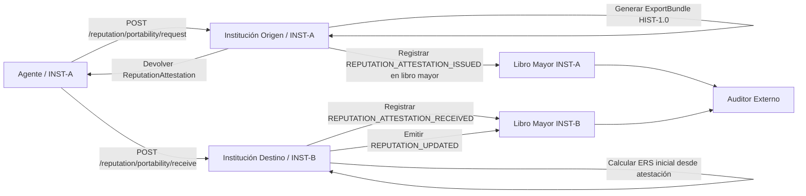

# ACP-REP-PORTABILITY-1.0 — Portabilidad de Reputación Cross-Organizacional

**Versión:** 1.0
**Estado:** Activo
**Dependencias:** ACP-REP-1.2, ACP-ITA-1.1, ACP-HIST-1.0, ACP-LEDGER-1.2, ACP-SIGN-1.0
**Implementa:** ACP-CONF-1.1 Nivel de Conformidad L4
**Implementa:** ACP-REP-1.1 §12.1 (Federación de reputación inter-institucional)
**Relacionado:** ACP-CROSS-ORG-1.0

---

## Resumen

ACP-REP-PORTABILITY-1.0 define el protocolo bilateral mediante el cual el historial de reputación de un agente puede transportarse desde su institución de origen (fuente) hacia una institución extranjera (destino), sin que el destino tenga que confiar en la institución origen incondicionalmente y sin revelar el historial de comportamiento interno completo.

Esta especificación cierra el vacío identificado en ACP-REP-1.1 §12.1 ("Federación de reputación inter-institucional") y parcialmente abordado en ACP-REP-1.2 (Dual Trust Bootstrap). Donde REP-1.2 proporciona un mecanismo de garantía unidireccional (la institución avala al agente a solicitud del agente), esta especificación provee el intercambio bilateral completo: un formato formal `ReputationAttestation`, un protocolo de consulta, un procedimiento de verificación y las reglas que rigen cómo la institución destino calcula su ERS inicial a partir de la atestación.

La garantía de privacidad se preserva: la institución destino recibe una puntuación numérica firmada y un conjunto de referencias de eventos, no el historial de comportamiento completo. La garantía de auditabilidad se preserva: la atestación puede verificarse independientemente contra el libro mayor de la institución origen vía HIST-1.0.

---

## 1. Alcance

Este documento define:

- El formato `ReputationAttestation` y sus campos
- El protocolo bilateral de solicitud/respuesta para portabilidad de reputación
- Cómo la institución destino verifica y consume una atestación
- Cómo se calcula y almacena el ERS resultante
- Los eventos de libro mayor `REPUTATION_ATTESTATION_ISSUED` y `REPUTATION_ATTESTATION_RECEIVED`
- Los endpoints de consulta para gestión del ciclo de vida de atestaciones
- Requisitos de conformidad

Este documento **no** define:
- El modelo de cálculo de puntuación de confianza interna (ITS) (ver ACP-REP-1.2)
- El mecanismo Dual Trust Bootstrap (ver ACP-REP-1.2 §10)
- Puntuación oracle descentralizada basada en ZK-proof (futuro: ACP-REP-ORACLE)
- Reputación de verificadores externos con staking (futuro: ACP-REP-1.1 §12.2)

---

## 2. Terminología

**ReputationAttestation:** Documento firmado emitido por la institución origen que certifica el `ExternalReputationScore` del agente en un momento específico, respaldado por referencias de libro mayor verificables.

**ExternalReputationScore (ERS):** Tal como se define en ACP-REP-1.2. La reputación del agente en el ecosistema cross-institucional, portable bajo las condiciones definidas en esta especificación.

**InternalTrustScore (ITS):** Tal como se define en ACP-REP-1.2. La reputación interna del agente dentro de su institución de origen. Nunca se transmite directamente — solo se exporta el ERS derivado.

**AttestationScore:** El valor numérico en la `ReputationAttestation`. Derivado del ERS del agente en el momento de la atestación. Sujeto a un techo máximo (ver §5).

**PortabilityRequest:** Solicitud de un agente (o de su institución destino en nombre del agente) a la institución origen para emitir una `ReputationAttestation`.

**AttestationVerification:** El proceso mediante el cual la institución destino valida una `ReputationAttestation` antes de incorporar su puntuación en el cálculo local de ERS.

---

## 3. Principios de Diseño

**Soberanía institucional:** La institución origen controla qué puntuación certifica. La institución destino controla cómo usa la atestación. Ninguna institución puede obligar a la otra.

**Preservación de privacidad:** La atestación contiene una puntuación numérica y referencias de eventos, no detalles de comportamiento. La institución destino no puede reconstruir el historial de puntuación interna a partir de la atestación por sí sola.

**Verificable independientemente:** El campo `references` contiene IDs de eventos LEDGER-1.2. La institución destino puede verificar la integridad de la atestación sin confiar en la institución origen — puede solicitar los eventos referenciados vía ExportBundle de HIST-1.0 y verificar la cadena de hashes de forma independiente.

**Temporalmente acotado:** Todas las atestaciones tienen `valid_from` / `valid_to`. Una puntuación de hace 3 años no otorga privilegios actuales. Esto preserva el modelo de decaimiento de ACP-REP-1.2 a través de fronteras institucionales.

**No transitivo:** Una atestación de INST-A a INST-B no autoriza a INST-B a re-atestar la misma puntuación hacia INST-C. La re-atestación está prohibida. Cada institución atestigua desde su propio libro mayor.

---

## 4. Formato ReputationAttestation

### 4.1 Esquema

```json
{
  "attestation_id": "<uuid_v4>",
  "attestation_version": "1.0",
  "agent_id": "AGT-001",
  "source_institution_id": "INST-A",
  "target_institution_id": "INST-B",
  "external_score": 0.83,
  "score_components": {
    "its_at_issuance": 0.91,
    "ers_at_issuance": 0.74,
    "event_count": 138,
    "evaluation_window_days": 180
  },
  "valid_from": "2026-03-11T00:00:00Z",
  "valid_to": "2026-09-11T00:00:00Z",
  "issued_at": "2026-03-11T12:00:00Z",
  "references": [
    "evt-987-REPUTATION_UPDATED",
    "evt-654-LIABILITY_RECORD",
    "evt-321-REPUTATION_UPDATED"
  ],
  "export_bundle_url": "https://inst-a.example.com/acp/v1/audit/export/<bundle_id>",
  "non_transitive": true,
  "signature": "base64url_ed25519_sig_INST_A_ARK_over_canonical_attestation"
}
```

### 4.2 Definición de Campos

| Campo | Tipo | Requerido | Descripción |
|-------|------|-----------|-------------|
| `attestation_id` | string (UUID v4) | ✓ | Identificador único de esta atestación. |
| `attestation_version` | string | ✓ | Siempre `"1.0"` para esta versión de spec. |
| `agent_id` | string | ✓ | ID de agente ACP (`base58(SHA-256(pubkey))`) según ACP-SIGN-1.0. |
| `source_institution_id` | string | ✓ | Institución que posee el registro de reputación primario del agente. |
| `target_institution_id` | string | ✓ | Institución para la cual se emite esta atestación. Una atestación es de uso único por destino. |
| `external_score` | float [0.0, 1.0] | ✓ | Puntuación certificada. Sujeta a techo (§5.2). Este es el valor que usa la institución destino. |
| `score_components` | object | ✓ | Desglose no vinculante para transparencia. Ver §4.3. |
| `valid_from` | string (ISO 8601) | ✓ | Inicio efectivo de la atestación. |
| `valid_to` | string (ISO 8601) | ✓ | Expiración de la atestación. Duración máxima: 180 días. |
| `issued_at` | string (ISO 8601) | ✓ | Timestamp de emisión. DEBE ser ≤ `valid_from`. |
| `references` | array[string] | ✓ | Mínimo 5 IDs de eventos del libro mayor origen (mezcla de `REPUTATION_UPDATED` y `LIABILITY_RECORD`). Cada ID debe ser verificable vía HIST-1.0. |
| `export_bundle_url` | string (URL) | ✓ | Endpoint de exportación HIST-1.0 que devuelve un ExportBundle con los eventos referenciados. La URL DEBE ser accesible para la institución destino durante la ventana de verificación. |
| `non_transitive` | boolean | ✓ | Siempre `true`. La institución destino no puede re-atestar esta puntuación. |
| `signature` | string | ✓ | Firma Ed25519 sobre la atestación canónica JCS (excluyendo el campo `signature` en sí), firmada con el ARK de la institución origen. |

### 4.3 Componentes de Puntuación (bloque de transparencia)

El objeto `score_components` no es vinculante — el `external_score` es el valor autorizado. Su propósito es dar a la institución destino visibilidad sobre cómo se derivó la puntuación:

| Campo | Descripción |
|-------|-------------|
| `its_at_issuance` | ITS del agente en el momento de la emisión de la atestación. |
| `ers_at_issuance` | ERS del agente en el momento de la emisión de la atestación. |
| `event_count` | Número de eventos puntuados en la ventana de evaluación. |
| `evaluation_window_days` | Duración de la ventana usada para calcular la puntuación. |

---

## 5. Derivación de la Puntuación de Atestación

### 5.1 Cálculo base

El `external_score` en la atestación se calcula como:

```
attestation_score = 0.6 · its_at_issuance + 0.4 · ers_at_issuance
```

Esto coincide con la fórmula compuesta de ACP-REP-1.2. La puntuación de atestación representa el compuesto dual-trust completo del agente en el momento de la emisión.

### 5.2 Techo

Para prevenir manipulación mediante cadenas de atestación, se aplica un techo:

```
external_score ≤ 0.85
```

Un agente con un historial interno + externo perfecto (compuesto = 1.0) será atestado como máximo en 0.85. Este techo:
- Asegura que las observaciones propias de la institución destino retengan valor de señal
- Previene el "lavado de reputación" (una institución inflando puntuaciones para otorgar privilegios excesivos en otras partes)
- Deja margen para que el ERS propio del destino se acumule a partir del comportamiento observado real

### 5.3 Elegibilidad mínima

Una institución origen NO DEBE emitir una atestación para un agente que no cumpla:

```
event_count ≥ 10    AND
its_at_issuance ≥ 0.50
```

Un agente con historial insuficiente o con puntuación interna por debajo del umbral no puede ser atestado. Esto se alinea con las reglas de elegibilidad de bootstrap de ACP-REP-1.2 §10.

---

## 6. Protocolo: PortabilityRequest → Emisión de Atestación

### 6.1 Flujo de solicitud

Un agente (o la institución destino en nombre del agente) envía un `PortabilityRequest` a la institución origen:

```
POST /acp/v1/reputation/portability/request
Authorization: <token PoP del agente, ACP-HP-1.0>
Content-Type: application/json

{
  "agent_id": "AGT-001",
  "target_institution_id": "INST-B",
  "requested_valid_from": "2026-03-11T00:00:00Z",
  "requested_valid_to": "2026-09-11T00:00:00Z"
}
```

### 6.2 Procesamiento de la institución origen

Al recibir un `PortabilityRequest`, la institución origen DEBE:

1. **Verificar identidad del agente:** validar el token PoP vinculado a `agent_id` según ACP-HP-1.0.
2. **Verificar elegibilidad del agente:** comprobar `event_count ≥ 10` y `its_at_issuance ≥ 0.50` (§5.3).
3. **Verificar federación:** confirmar federación activa entre origen y `target_institution_id` vía ACP-ITA-1.1.
4. **Comprobar atestación válida existente:** si ya existe una atestación no vencida para el par `(agent_id, target_institution_id)`, devolverla (idempotente).
5. **Calcular `attestation_score`:** según §5.1 y §5.2.
6. **Seleccionar `references`:** elegir mínimo 5 eventos recientes `REPUTATION_UPDATED` o `LIABILITY_RECORD` del historial del agente.
7. **Generar ExportBundle:** vía `POST /acp/v1/audit/export` (HIST-1.0), filtrado a las referencias seleccionadas.
8. **Emitir atestación:** firmar con ARK origen, registrar en libro mayor como `REPUTATION_ATTESTATION_ISSUED`.

### 6.3 Respuesta

```json
{
  "status": "issued",
  "attestation": { "<ReputationAttestation completa>" },
  "export_bundle_url": "https://inst-a.example.com/acp/v1/audit/export/bundle-xyz",
  "ledger_event_id": "<event_id de REPUTATION_ATTESTATION_ISSUED>"
}
```

---

## 7. Protocolo: Atestación → Verificación en Institución Destino

### 7.1 Recepción de una atestación

El agente presenta la `ReputationAttestation` a la institución destino vía:

```
POST /acp/v1/reputation/portability/receive
Authorization: <token PoP del agente, ACP-HP-1.0>
Content-Type: application/json

{
  "agent_id": "AGT-001",
  "attestation": { "<ReputationAttestation completa>" }
}
```

### 7.2 Pasos de verificación de la institución destino

La institución destino DEBE ejecutar todos los siguientes en orden:

1. **Verificar expiración:** `valid_to` DEBE ser en el futuro. Las atestaciones vencidas se rechazan (PORT-006).
2. **Verificar federación:** `GET /ita/v1/federation/resolve/{source_institution_id}` — confirmar federación activa. (PORT-007 si no se encuentra.)
3. **Verificar firma:** validar `signature` contra el ARK de la institución origen (obtenido vía ITA-1.1). (PORT-008 si inválida.)
4. **Verificar `non_transitive: true`:** rechazar cualquier atestación donde este campo esté ausente o sea `false`. (PORT-009.)
5. **Verificar coincidencia de destino:** `target_institution_id` en la atestación DEBE coincidir con el ID de esta institución. (PORT-010.)
6. **Verificar referencias (opcional pero RECOMENDADO):** solicitar ExportBundle desde `export_bundle_url`, verificar integridad de eventos según HIST-1.0 §7. (PORT-011 si la verificación falla.)
7. **Comprobar idempotencia:** si la atestación con `attestation_id` ya fue procesada, devolver 200 OK con resultado existente.
8. **Registrar `REPUTATION_ATTESTATION_RECEIVED`** en el libro mayor destino.
9. **Calcular ERS inicial** según §7.3.
10. **Emitir `REPUTATION_UPDATED`** en el libro mayor destino con el nuevo ERS.

### 7.3 Cálculo del ERS inicial a partir de la atestación

La institución destino usa la puntuación de atestación como **semilla inicial de ERS** para el agente, sujeta a un descuento:

```
discount_factor = 1 - (1 / (1 + event_count_in_references / 10))
initial_ers = attestation.external_score * discount_factor * 0.85
```

Donde:
- `event_count_in_references` = número de entradas en el campo `references`
- El techo exterior `0.85` asegura que la puntuación atestada nunca reemplace al comportamiento observado localmente
- `discount_factor` crece hacia 1 a medida que aumenta el volumen de evidencia

**Ejemplo:**
```
attestation.external_score = 0.83
event_count_in_references = 20
discount_factor = 1 - (1 / (1 + 20/10)) = 1 - (1/3) = 0.667
initial_ers = 0.83 * 0.667 * 0.85 = 0.470
```

El ERS inicial `0.470` siembra la reputación del agente en la institución destino. A partir de este punto, el ciclo de puntuación estándar de ACP-REP-1.2 se aplica: cada evento `LIABILITY_RECORD` posterior actualiza el ERS.

---

## 8. Ejemplo Completo

### 8.1 Flujo completo: Agente 001 migra de INST-A a INST-B

```
[INST-A: libro mayor origen]
seq 200: REPUTATION_ATTESTATION_ISSUED → att_id: "att-c9d8..."

[Agente 001]
Presenta atestación a INST-B

[INST-B: libro mayor destino]
seq 14: REPUTATION_ATTESTATION_RECEIVED → att_id: "att-c9d8..."
seq 15: REPUTATION_UPDATED → nuevo ERS = 0.470 (sembrado desde atestación)

[Posterior en INST-B]
seq 27: LIABILITY_RECORD → ejecución por AGT-001
seq 28: REPUTATION_UPDATED → ERS actualizado por el motor REP-1.2 propio de INST-B
```

### 8.2 ReputationAttestation JSON completa

```json
{
  "attestation_id": "att-c9d8-4e7f-8a2b-123456789012",
  "attestation_version": "1.0",
  "agent_id": "AGT-001",
  "source_institution_id": "INST-A",
  "target_institution_id": "INST-B",
  "external_score": 0.83,
  "score_components": {
    "its_at_issuance": 0.91,
    "ers_at_issuance": 0.74,
    "event_count": 138,
    "evaluation_window_days": 180
  },
  "valid_from": "2026-03-11T00:00:00Z",
  "valid_to": "2026-09-11T00:00:00Z",
  "issued_at": "2026-03-11T12:00:00Z",
  "references": [
    "evt-987-REPUTATION_UPDATED",
    "evt-654-LIABILITY_RECORD",
    "evt-543-REPUTATION_UPDATED",
    "evt-432-LIABILITY_RECORD",
    "evt-321-REPUTATION_UPDATED"
  ],
  "export_bundle_url": "https://inst-a.example.com/acp/v1/audit/export/bundle-xyz",
  "non_transitive": true,
  "signature": "base64url_ed25519_sig_INST_A_ARK_over_canonical_attestation"
}
```

---

## 9. Flujo de Interacción



---

## 10. Eventos de Libro Mayor

### 10.1 `REPUTATION_ATTESTATION_ISSUED` (libro mayor origen)

```json
{
  "event_type": "REPUTATION_ATTESTATION_ISSUED",
  "payload": {
    "attestation_id": "att-c9d8-...",
    "agent_id": "AGT-001",
    "target_institution_id": "INST-B",
    "external_score": 0.83,
    "valid_from": "2026-03-11T00:00:00Z",
    "valid_to": "2026-09-11T00:00:00Z",
    "references_count": 5
  }
}
```

### 10.2 `REPUTATION_ATTESTATION_RECEIVED` (libro mayor destino)

```json
{
  "event_type": "REPUTATION_ATTESTATION_RECEIVED",
  "payload": {
    "attestation_id": "att-c9d8-...",
    "agent_id": "AGT-001",
    "source_institution_id": "INST-A",
    "attested_score": 0.83,
    "computed_initial_ers": 0.470,
    "verification_steps_passed": 9,
    "references_verified": true
  }
}
```

Ambos tipos de eventos siguen el envelope de ACP-LEDGER-1.2 y se encadenan con hash normalmente. Un verificador LEDGER-1.2 v1.0 que encuentre estos tipos DEBE aplicar la regla LEDGER-008 (tipo desconocido, continuar cadena).

---

## 11. Endpoints de Consulta

### 11.1 Listar atestaciones emitidas por esta institución

```
GET /acp/v1/reputation/portability/issued
```

Parámetros: `agent_id`, `target_institution_id`, `status` (active|expired|revoked), `page`, `limit`.

### 11.2 Listar atestaciones recibidas por esta institución

```
GET /acp/v1/reputation/portability/received
```

Parámetros: `agent_id`, `source_institution_id`, `status`, `page`, `limit`.

### 11.3 Obtener atestación específica

```
GET /acp/v1/reputation/portability/attestations/{attestation_id}
```

### 11.4 Revocar una atestación

```
DELETE /acp/v1/reputation/portability/attestations/{attestation_id}
```

Una institución origen puede revocar una atestación vigente. Tras la revocación:
- La atestación queda marcada como `status: revoked` en el libro mayor origen.
- Se emite un evento `REPUTATION_ATTESTATION_REVOKED` en el libro mayor origen.
- La institución destino es notificada vía ACP-NOTIFY-1.0.
- La institución destino DEBE dejar de usar la puntuación de la atestación como entrada positiva; el ERS del agente en la institución destino vuelve a basarse únicamente en el comportamiento observado localmente.

---

## 12. Modelo de Privacidad

**Qué ve la institución destino:**
- Una puntuación numérica (`external_score`)
- Un conjunto de IDs de eventos (opacos para el destino sin acceso al libro mayor origen)
- Componentes de puntuación (bloque de transparencia no vinculante)
- Ventana de validez

**Qué NO ve la institución destino:**
- Registros de comportamiento individuales
- Historial completo de cálculo de ITS
- Tokens de capacidad o cadenas de delegación
- Evaluaciones de riesgo internas

**Qué permanece privado:**
- El historial de comportamiento completo del agente en INST-A
- Cualquier información que permita a INST-B reconstruir el ITS de forma independiente

**Auditabilidad:** Un regulador con acceso a ambos libros mayores y al ExportBundle puede reconstruir la cadena de procedencia completa (ITS → attestation_score → ERS inicial en INST-B → evolución de ERS). Este es el mismo modelo de auditor que AGS-1.0 §7.4.

---

## 13. Códigos de Error

| Código | HTTP | Descripción |
|--------|------|-------------|
| PORT-001 | 400 | Solicitud malformada: falta campo requerido. |
| PORT-002 | 400 | `valid_to` supera la duración máxima de 180 días. |
| PORT-003 | 403 | Agente `event_count < 10`: historial insuficiente para atestación. |
| PORT-004 | 403 | Agente `its_at_issuance < 0.50`: por debajo del umbral mínimo para atestación. |
| PORT-005 | 403 | Re-atestación prohibida: `target_institution_id` está intentando re-atestar una atestación recibida. |
| PORT-006 | 410 | Atestación vencida (`valid_to` es en el pasado). |
| PORT-007 | 403 | No existe federación activa entre instituciones origen y destino (ITA-1.1). |
| PORT-008 | 422 | Verificación de firma de atestación fallida. |
| PORT-009 | 422 | `non_transitive` está ausente o es `false`: atestación rechazada. |
| PORT-010 | 403 | `target_institution_id` en la atestación no coincide con la institución receptora. |
| PORT-011 | 422 | Verificación de referencias de ExportBundle fallida: uno o más eventos referenciados no pudieron verificarse. |
| PORT-012 | 409 | Atestación con `attestation_id` ya procesada (idempotente). |
| PORT-013 | 404 | Agente no encontrado en el registro de la institución origen. |

---

## 14. Requisitos de Conformidad

Una implementación conforme a ACP-REP-PORTABILITY-1.0:

**DEBE:**
- Implementar `POST /acp/v1/reputation/portability/request` con todos los pasos de §6.2
- Aplicar las compuertas de elegibilidad (§5.3) antes de emitir
- Aplicar el techo de puntuación `external_score ≤ 0.85` (§5.2)
- Establecer `non_transitive: true` en todas las atestaciones emitidas
- Implementar `POST /acp/v1/reputation/portability/receive` con los 10 pasos de verificación de §7.2
- Calcular el ERS inicial usando la fórmula de §7.3
- Emitir eventos de libro mayor `REPUTATION_ATTESTATION_ISSUED` y `REPUTATION_ATTESTATION_RECEIVED` (§10)
- Emitir evento `REPUTATION_UPDATED` tras recepción exitosa
- Implementar el endpoint de revocación `DELETE /acp/v1/reputation/portability/attestations/{id}`
- Devolver todos los códigos de error de §13 con los códigos de estado HTTP correctos

**DEBERÍA:**
- Verificar referencias de `export_bundle_url` durante la recepción (§7.2 paso 6)
- Notificar a la institución destino sobre revocación vía ACP-NOTIFY-1.0
- Implementar endpoints de listado (§11.1, §11.2)

**PUEDE:**
- Cachear resolución de federación (se aplican reglas de TTL de ACP-ITA-1.1)
- Implementar reglas de decaimiento de ERS específicas de dominio más allá de las de ACP-REP-1.2

---

## 15. Dependencias

```
ACP-REP-PORTABILITY-1.0
├── ACP-REP-1.2              (modelo ERS/ITS, fórmulas de puntuación)
├── ACP-ITA-1.1              (verificación de federación, resolución de ARK)
├── ACP-HIST-1.0             (generación + verificación de ExportBundle)
├── ACP-LEDGER-1.2           (envelope de eventos, nuevos tipos de evento)
├── ACP-HP-1.0               (token PoP para verificación de identidad de agente)
├── ACP-SIGN-1.0             (derivación de AgentID, firmas Ed25519)
└── ACP-NOTIFY-1.0           (notificaciones de revocación)
```

---

## 16. Relación con ACP-REP-1.1 §12

Esta especificación implementa §12.1 de ACP-REP-1.1 ("Federación de reputación inter-institucional") usando un modelo bilateral centralizado en lugar de un oracle descentralizado. El diseño deliberadamente se limita a lo que es factible con la infraestructura v1.x:

| Concepto ACP-REP-1.1 §12 | Esta spec |
|--------------------------|-----------|
| §12.1 Federación inter-institucional | **Implementado** (este documento) |
| §12.2 Verificadores externos con staking | No implementado — requiere mecanismo de consenso |
| §12.3 Oracle descentralizado ACP-REP-ORACLE | No implementado — trabajo futuro; ZK-proofs aún no estandarizados en ACP |

El protocolo `ACP-REP-ORACLE` sigue siendo trabajo futuro. Esta especificación proporciona la vía bilateral lista para producción que puede desplegarse hoy con la infraestructura ACP v1.x existente.
