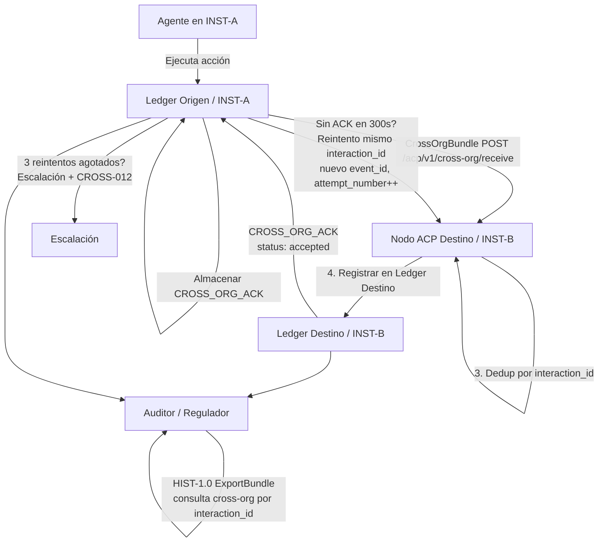

# ACP-CROSS-ORG-1.1 — Registro de Interacciones Cross-Organizacionales

**Versión:** 1.1
**Estado:** Activo
**Supersede:** ACP-CROSS-ORG-1.0
**Dependencias:** ACP-LEDGER-1.3, ACP-ITA-1.1, ACP-HIST-1.0, ACP-LIA-1.0, ACP-SIGN-1.0
**Implementa:** ACP-CONF-1.2 Nivel de Conformidad L4
**Relacionado:** ACP-REP-PORTABILITY-1.0

---

## Historial de cambios

- **v1.1** — Agrega protocolo bilateral tolerante a fallos. Introduce `interaction_id` (UUIDv7) como identificador de correlación obligatorio para deduplicación entre reintentos. Define modelo de estado derivado de interacción (§9). Agrega protocolo formal de reintento: 3 intentos, backoff +30s/+60s/+120s (§8). Formaliza SLA de `pending_review` (24h) y transiciones de estado (§8.4). Registra `CROSS_ORG_ACK` como tipo de evento de primer nivel en ACP-LEDGER-1.3 §5. Agrega códigos de error CROSS-012 a CROSS-015. Actualiza dependencia de ACP-LEDGER-1.2 a ACP-LEDGER-1.3.
- **v1.0** — Especificación inicial: tipo de evento `CROSS_ORG_INTERACTION`, protocolo de transmisión bilateral CrossOrgBundle, CrossOrgAck, extensiones de consulta HIST-1.0.

---

## Resumen

ACP-CROSS-ORG-1.1 define los tipos de evento `CROSS_ORG_INTERACTION` y `CROSS_ORG_ACK`, convirtiendo las interacciones entre sistemas de distintas organizaciones en entidades de primer nivel y auditabilidad completa dentro del libro mayor ACP. Extiende ACP-CROSS-ORG-1.0 con un protocolo bilateral tolerante a fallos completo: un identificador de correlación obligatorio (`interaction_id`), un mecanismo formal de reintento con backoff determinístico, un modelo de estado derivado de interacción, y una máquina de estados formal para `pending_review` con cumplimiento de SLA.

---

## 1. Alcance

Este documento define:

- Los tipos de evento `CROSS_ORG_INTERACTION` y `CROSS_ORG_ACK` y sus esquemas de payload
- Las reglas de emisión: quién emite, cuándo y bajo qué condiciones
- El protocolo de verificación bilateral: cómo la institución objetivo valida una interacción entrante
- El protocolo de reintento tolerante a fallos: qué ocurre cuando falla la transmisión o el acuse de recibo
- El modelo de estado derivado de interacción: cómo se computa `cross_org_status` a partir de eventos del ledger
- La máquina de estados `pending_review`: SLA, transiciones y vencimiento
- Las extensiones de consulta y exportación sobre ACP-HIST-1.0 para filtrado cross-org
- Requisitos de conformidad

Este documento **no** define:
- Cómo se establece la federación entre instituciones (ver ACP-ITA-1.1)
- Cómo se actualiza la reputación a partir de eventos cross-org (ver ACP-REP-PORTABILITY-1.0)
- Flujos de pago entre instituciones (ver ACP-PAY-1.0)

---

## 2. Terminología

**CROSS_ORG_INTERACTION:** Evento de libro mayor ACP emitido cuando un agente de una institución origen ejecuta una acción dirigida hacia, o que produce efectos verificables en, una institución destino.

**CROSS_ORG_ACK:** Tipo de evento de libro mayor ACP de primer nivel emitido por la institución destino para acusar recibo y validación de un CrossOrgBundle. Registrado en ACP-LEDGER-1.3 §5. Almacenado en el libro mayor de ambas instituciones.

**CrossOrgBundle:** Paquete firmado y auto-verificable que contiene uno o más eventos `CROSS_ORG_INTERACTION`, diseñado para ser transmitido a la institución destino y almacenado en su libro mayor.

**interaction_id:** Identificador UUIDv7 asignado a una interacción cross-org en el momento en que la origen emite el primer evento `CROSS_ORG_INTERACTION`. Este identificador es **inmutable** y **reutilizado en todos los reintentos** de la misma interacción lógica. Es la clave canónica de deduplicación en el destino.

**event_id:** Identificador UUIDv4 único para una emisión específica de evento de libro mayor. Cada reintento produce un nuevo `event_id` mientras reutiliza el mismo `interaction_id`.

**Estado derivado de interacción:** Estado computado de una interacción cross-org, derivado de los eventos presentes en el ledger. El estado nunca se almacena directamente — siempre se computa a partir del registro de eventos. Ver §9.

**ActionType:** Enumeración de categorías de acción cross-organizacional. Extensible; las instituciones pueden definir subtipos específicos de dominio con prefijo `x:`.

**PayloadHash:** Hash SHA-256 de la representación canónica (JCS, RFC 8785) del payload de interacción. El payload nunca se transmite — solo el hash.

**ZKP:** Prueba de conocimiento cero, campo opcional. Permite a la institución origen demostrar una propiedad de la interacción sin revelar el payload completo.

---

## 3. Motivación

El modelo de autorización ACP es institucional: cada institución mantiene su propio libro mayor, sus propios agentes y su propia evaluación de riesgos. Cuando dos instituciones interactúan, el modelo existente captura solo el registro de la institución origen, dejando a la institución destino sin registros a menos que implemente instrumentación propia.

ACP-CROSS-ORG-1.0 cerró la brecha de asimetría. ACP-CROSS-ORG-1.1 cierra la **brecha de tolerancia a fallos**: qué ocurre cuando algún paso del protocolo bilateral de 5 pasos falla. Sin un protocolo de reintento definido, un destino que recibe un bundle pero cae antes de escribir en su ledger crea un audit trail inconsistente. Sin un modelo de estado formal, el filtro de consulta `cross_org_status` en §10 carece de semántica definida. Sin un SLA de `pending_review`, las interacciones pueden quedar sin resolver indefinidamente.

---

## 4. Tipo de Evento: `CROSS_ORG_INTERACTION`

### 4.1 Envelope

El evento sigue el envelope estándar de ACP-LEDGER-1.3:

```json
{
  "ver": "1.3",
  "event_id": "<uuid_v4>",
  "event_type": "CROSS_ORG_INTERACTION",
  "sequence": 42,
  "timestamp": "<unix_timestamp_ms>",
  "institution_id": "<id_institucion_origen>",
  "prev_hash": "<sha256_evento_anterior_canonico>",
  "payload": { ... },
  "hash": "<sha256_base64url_evento>",
  "sig": "<ed25519_base64url_sobre_envelope_canonico>"
}
```

El `institution_id` en el envelope es **siempre la institución origen**. La institución destino almacena este evento en su propio ledger con su propio envelope envolviendo el CrossOrgBundle (ver §7).

### 4.2 Esquema de Payload

```json
{
  "interaction_id": "01951b2c-7e3f-7a1d-a8b4-5c9d8e7f6012",
  "event_id": "e7f9c8a1-5b2c-4d3e-987f-1234567890ab",
  "timestamp": "2026-03-18T12:00:00Z",
  "source_institution_id": "INST-A",
  "target_institution_id": "INST-B",
  "action_type": "DATA_SHARE",
  "payload_hash": "a1b2c3d4e5f6a1b2c3d4e5f6a1b2c3d4e5f6a1b2c3d4e5f6a1b2c3d4e5f6a1b2",
  "delegation_chain": [
    {
      "agent_id": "AGT-001",
      "institution_id": "INST-A",
      "capability": "acp:cap:data.share",
      "sig": "base64url(firma_ed25519_sobre_paso_delegacion)"
    }
  ],
  "authorization_id": "<uuid_evento_AUTHORIZATION_en_ledger_origen>",
  "liability_record_id": "<uuid_LIABILITY_RECORD_en_ledger_origen>",
  "attempt_number": 1,
  "proof": "zkp_base64url_codificado_opcional_o_null",
  "ack_required": true,
  "metadata": {
    "protocol_version": "1.1",
    "domain": "finance",
    "classification": "confidential"
  }
}
```

### 4.3 Definición de Campos

| Campo | Tipo | Requerido | Descripción |
|-------|------|-----------|-------------|
| `interaction_id` | string (UUIDv7) | ✓ | Identificador de interacción globalmente único. Asignado en la primera emisión. **Reutilizado en todos los reintentos de la misma interacción lógica.** Clave primaria de deduplicación en el destino. MUST ser inmutable una vez asignado. |
| `event_id` | string (UUIDv4) | ✓ | Identificador único para esta emisión específica de evento de ledger. Cada reintento genera un nuevo `event_id`. |
| `timestamp` | string (ISO 8601) | ✓ | Timestamp UTC de esta emisión. |
| `source_institution_id` | string | ✓ | ID de institución ACP de la institución iniciadora. MUST coincidir con el `institution_id` del envelope. |
| `target_institution_id` | string | ✓ | ID de institución ACP de la institución receptora. MUST estar registrada en la federación ITA (ACP-ITA-1.1). |
| `action_type` | string (enum) | ✓ | Categoría de acción cross-org. Ver §4.4. |
| `payload_hash` | string (hex, 64 chars) | ✓ | SHA-256 del payload de interacción en forma canónica JCS. El payload nunca se transmite. MUST ser idéntico en todos los reintentos. |
| `delegation_chain` | array | ✓ | Lista ordenada de pasos de delegación desde la capacidad raíz hasta el agente actuante. Mínimo 1 entrada. |
| `authorization_id` | string (UUID) | ✓ | UUID del evento `AUTHORIZATION` en el ledger de la institución **origen** que autorizó esta interacción. |
| `liability_record_id` | string (UUID) | ✓ | UUID del evento `LIABILITY_RECORD` en el ledger de la institución **origen**. MUST haberse emitido antes o en la misma secuencia que este evento. |
| `attempt_number` | integer | ✓ | Contador de intento base 1. Primera emisión: `1`. Cada reintento incrementa este campo. MUST ser monótonamente creciente por `interaction_id`. |
| `proof` | string \| null | ○ | Prueba ZK opcional. Formato: `zkp:<esquema>:<datos_base64url>`. |
| `ack_required` | boolean | ✓ | Cuando `true`, la institución destino MUST emitir un `CROSS_ORG_ACK` y transmitirlo de regreso. |
| `metadata` | object | ○ | Metadatos específicos del dominio. Claves reservadas: `protocol_version`, `domain`, `classification`. |

### 4.4 Enumeración ActionType

| ActionType | Descripción |
|-----------|-------------|
| `DATA_SHARE` | La origen comparte datos (dataset, reporte, stream) con el destino. |
| `SERVICE_INVOCATION` | El agente origen invoca un endpoint de servicio en el destino. |
| `DELEGATION_TRANSFER` | La origen transfiere una delegación de capacidad a un agente en el destino. |
| `COMPLIANCE_QUERY` | La origen consulta el estado regulatorio/compliance en el destino. |
| `FINANCIAL_SETTLEMENT` | La origen inicia una liquidación financiera dirigida al destino. Requiere ACP-PAY-1.0. |
| `AUDIT_REQUEST` | La origen solicita un segmento de auditoría (ExportBundle) al destino. |
| `REPUTATION_QUERY` | La origen consulta datos de reputación del agente en el destino. Ver ACP-REP-PORTABILITY-1.0. |
| `x:<custom>` | Definido por la institución. MUST tener prefijo `x:` para evitar colisiones con tipos reservados. |

---

## 5. Reglas de Emisión

**CROSS-RULE-1:** Un evento `CROSS_ORG_INTERACTION` MUST ser emitido por la **institución origen** en su propio ledger por cada acción que cruce una frontera de confianza institucional, según lo define la federación activa (ACP-ITA-1.1).

**CROSS-RULE-2:** El evento MUST emitirse **después** del `LIABILITY_RECORD` para la misma ejecución. El campo `liability_record_id` MUST referenciar un evento que ya existe en el ledger origen.

**CROSS-RULE-3:** El `authorization_id` MUST referenciar un evento `AUTHORIZATION` que precedió esta interacción en el ledger origen. Si el evento `AUTHORIZATION` no se encuentra, la emisión está prohibida y la interacción MUST bloquearse.

**CROSS-RULE-4:** El `payload_hash` MUST computarse sobre la forma canónica JCS del payload de interacción completo antes de la transmisión. Nunca se actualiza después de la emisión.

**CROSS-RULE-5:** Si `ack_required` es `true`, la institución origen MUST implementar el protocolo de reintento definido en §8. Si no se recibe ningún `CrossOrgAck` tras el número máximo de intentos, la origen MUST establecer `retry_exhausted = true` en sus metadatos de observabilidad (§8.5) y emitir un evento `ESCALATION_CREATED`.

**CROSS-RULE-6:** Si no existe una federación entre `source_institution_id` y `target_institution_id` (verificado vía `GET /ita/v1/federation/resolve/{target_institution_id}`), el evento MUST NOT emitirse y MUST retornarse el error CROSS-004.

**CROSS-RULE-7:** El `interaction_id` MUST asignarse en la primera emisión y MUST permanecer idéntico en todos los reintentos. El `payload_hash` y `action_type` MUST ser idénticos en todos los reintentos del mismo `interaction_id`. Las implementaciones MUST NOT asignar un nuevo `interaction_id` para un reintento.

---

## 6. Ejemplo Completo

### 6.1 Interacción: La Institución A comparte un reporte de datos con la Institución B

**Secuencia en el ledger origen (INST-A):**

```
seq 38: AUTHORIZATION          → auth_id: "auth-9a3f..."
seq 39: EXECUTION_TOKEN_CONSUMED → et_id: "et-7c2b..."
seq 40: LIABILITY_RECORD       → lia_id: "lia-5d1e..."
seq 41: CROSS_ORG_INTERACTION  → interaction_id: "01951b2c...", event_id: "e7f9c8a1...", attempt_number: 1
```

**Evento CROSS_ORG_INTERACTION completo (seq 41, primer intento):**

```json
{
  "ver": "1.3",
  "event_id": "e7f9c8a1-5b2c-4d3e-987f-1234567890ab",
  "event_type": "CROSS_ORG_INTERACTION",
  "sequence": 41,
  "timestamp": 1742299200000,
  "institution_id": "INST-A",
  "prev_hash": "9f3bc2a1e4d7890123456789abcdef0123456789abcdef0123456789abcdef01",
  "payload": {
    "interaction_id": "01951b2c-7e3f-7a1d-a8b4-5c9d8e7f6012",
    "event_id": "e7f9c8a1-5b2c-4d3e-987f-1234567890ab",
    "timestamp": "2026-03-18T12:00:00Z",
    "source_institution_id": "INST-A",
    "target_institution_id": "INST-B",
    "action_type": "DATA_SHARE",
    "payload_hash": "a1b2c3d4e5f6a1b2c3d4e5f6a1b2c3d4e5f6a1b2c3d4e5f6a1b2c3d4e5f6a1b2",
    "delegation_chain": [
      {
        "agent_id": "AGT-001",
        "institution_id": "INST-A",
        "capability": "acp:cap:data.share",
        "sig": "base64url_firma_AGT001_sobre_paso_delegacion"
      }
    ],
    "authorization_id": "auth-9a3f-4b2c-8d1e-567890abcdef",
    "liability_record_id": "lia-5d1e-4c3b-9a2f-890123abcdef",
    "attempt_number": 1,
    "proof": null,
    "ack_required": true,
    "metadata": {
      "protocol_version": "1.1",
      "domain": "finance",
      "classification": "confidential"
    }
  },
  "hash": "base64url_sha256_del_evento",
  "sig": "base64url_firma_ed25519_INST_A_sobre_evento_canonico"
}
```

---

## 7. CrossOrgBundle — Protocolo de Transmisión Bilateral

### 7.1 Estructura del bundle

Después de emitir el evento en el ledger origen, la institución origen lo empaqueta para transmisión al destino:

```json
{
  "bundle_id": "<uuid_v4>",
  "bundle_version": "1.1",
  "interaction_id": "01951b2c-7e3f-7a1d-a8b4-5c9d8e7f6012",
  "source_institution_id": "INST-A",
  "target_institution_id": "INST-B",
  "created_at": "2026-03-18T12:00:01Z",
  "attempt_number": 1,
  "events": [
    { "<evento CROSS_ORG_INTERACTION completo como arriba>" }
  ],
  "evidence": {
    "authorization_export": "<ExportBundle de HIST-1.0 filtrado por auth_id>",
    "liability_export": "<ExportBundle de HIST-1.0 filtrado por lia_id>"
  },
  "sig": "base64url_firma_ed25519_INST_A_sobre_bundle_canonico"
}
```

El bloque `evidence` es opcional pero RECOMMENDED. El `interaction_id` en el bundle MUST coincidir con el `interaction_id` en todos los eventos contenidos.

### 7.2 Endpoint de transmisión

La institución origen hace POST del bundle al nodo ACP del destino:

```
POST /acp/v1/cross-org/receive
Content-Type: application/json

Body: <CrossOrgBundle>
```

### 7.3 Pasos de validación en el destino

Al recibir un CrossOrgBundle, la institución destino MUST:

1. **Verificar federación:** `GET /ita/v1/federation/resolve/{source_institution_id}` — confirmar que existe federación activa.
2. **Verificar firma del bundle:** validar `sig` contra el ARK de la institución origen (obtenido vía federación ITA).
3. **Verificar firma de cada evento:** validar el `sig` de cada evento usando el ARK de la institución origen.
4. **Verificar integridad de cadena de hashes:** si hay múltiples eventos en el bundle, verificar enlace secuencial de `prev_hash`.
5. **Verificar referencias (opcional):** si `evidence.authorization_export` está presente, verificar integridad del ExportBundle per HIST-1.0 §7.
6. **Verificar idempotencia por `interaction_id`:** si ya existe un evento con el mismo `interaction_id` registrado exitosamente en el ledger local (con un ACK `accepted` ya emitido), retornar 200 OK con el ACK existente sin reprocesar. Esta es la verificación canónica de deduplicación.
7. **Registrar en ledger local:** emitir un evento `CROSS_ORG_INTERACTION` en el ledger propio del destino con `institution_id` = ID de la institución destino y referencia al `interaction_id` original.

### 7.4 CrossOrgAck — Evento de Ledger `CROSS_ORG_ACK`

Si `ack_required` es `true`, la institución destino MUST emitir un evento `CROSS_ORG_ACK` en su ledger (per ACP-LEDGER-1.3 §5.15) y transmitir el payload a la origen:

```json
{
  "ack_id": "<uuid_v4>",
  "interaction_id": "01951b2c-7e3f-7a1d-a8b4-5c9d8e7f6012",
  "original_event_id": "e7f9c8a1-5b2c-4d3e-987f-1234567890ab",
  "target_institution_id": "INST-B",
  "source_institution_id": "INST-A",
  "validated_at": "2026-03-18T12:00:02Z",
  "status": "accepted",
  "ledger_sequence": 17,
  "sig": "base64url_firma_ed25519_INST_B_sobre_ack_canonico"
}
```

Valores de `status`: `accepted` | `rejected` (con `rejection_reason`) | `pending_review`.

La institución origen MUST almacenar el `CROSS_ORG_ACK` en su propio ledger como evento `CROSS_ORG_ACK` (per ACP-LEDGER-1.3 §5.15).

**Regla de precedencia de ACK:** Un `CROSS_ORG_ACK` con `status: accepted` o `status: rejected` recibido en cualquier momento MUST cancelar cualquier temporizador de reintento pendiente. Un ACK siempre tiene precedencia sobre el estado de reintento.

---

## 8. Tolerancia a Fallos y Protocolo de Reintento

### 8.1 Modelo

ACP-CROSS-ORG-1.1 usa un **modelo async explícito**: la institución origen no bloquea esperando un `CROSS_ORG_ACK`. Se declara consistencia eventual: el ledger origen PUEDE registrar un `CROSS_ORG_INTERACTION` antes de que el destino lo registre. El `interaction_id` provee el ancla de correlación entre todas las instituciones y todos los intentos.

### 8.2 Especificación de Reintento

Cuando `ack_required: true` y no se recibe ningún `CROSS_ORG_ACK` dentro de los 300 segundos de cada intento:

| Intento | Espera antes de reintento | Espera acumulada |
|---------|--------------------------|-----------------|
| 1 (inicial) | — | 0s |
| 2 (reintento 1) | 300s + 30s backoff | 330s |
| 3 (reintento 2) | 300s + 60s backoff | 690s |
| Tras intento 3 | sin más reintentos | — |

**CROSS-RULE-8:** Cada reintento MUST reutilizar el mismo `interaction_id`. Cada reintento MUST emitir un nuevo evento `CROSS_ORG_INTERACTION` en el ledger origen con un nuevo `event_id` e `attempt_number` incrementado.

**CROSS-RULE-9:** El `payload_hash`, `action_type`, `authorization_id` y `liability_record_id` MUST ser idénticos en todos los eventos de reintento para el mismo `interaction_id`. Un reintento con payload modificado es una violación de protocolo.

**CROSS-RULE-10:** Si un `CROSS_ORG_ACK` válido (status `accepted` o `rejected`) llega en cualquier momento durante la secuencia de reintentos, la origen MUST cancelar todos los temporizadores de reintento pendientes y MUST NOT emitir más eventos de reintento para ese `interaction_id`.

**CROSS-RULE-11:** Tras agotar todos los reintentos sin recibir un `CROSS_ORG_ACK`, la origen MUST:
- Establecer `retry_exhausted = true` en su registro local de observabilidad (§8.5).
- Emitir un evento `ESCALATION_CREATED` referenciando el `interaction_id`.
- Retornar el error CROSS-012.

### 8.3 Secuencia en el Ledger Origen para un Reintento

```
seq 41: CROSS_ORG_INTERACTION  → interaction_id: "01951b2c...", event_id: "e7f9c8a1...", attempt_number: 1
        [timeout 300s — sin ACK]
seq 44: CROSS_ORG_INTERACTION  → interaction_id: "01951b2c...", event_id: "f8a0d9b2...", attempt_number: 2
        [timeout 300s — sin ACK]
seq 47: CROSS_ORG_INTERACTION  → interaction_id: "01951b2c...", event_id: "a1b2c3d4...", attempt_number: 3
        [timeout 300s — reintentos agotados]
seq 48: ESCALATION_CREATED     → interaction_id: "01951b2c..."
```

### 8.4 Máquina de Estados `pending_review`

Cuando el destino emite `CROSS_ORG_ACK` con `status: pending_review`, la interacción requiere revisión humana o de sistema en el destino antes de una determinación final.

**SLA:** Una interacción `pending_review` MUST resolverse dentro de las **24 horas** del timestamp del ACK. El campo `review_deadline` en el payload del ACK especifica el deadline exacto en segundos Unix.

```json
{
  "ack_id": "<uuid_v4>",
  "interaction_id": "01951b2c-7e3f-7a1d-a8b4-5c9d8e7f6012",
  "original_event_id": "e7f9c8a1-5b2c-4d3e-987f-1234567890ab",
  "target_institution_id": "INST-B",
  "source_institution_id": "INST-A",
  "validated_at": "2026-03-18T12:00:02Z",
  "status": "pending_review",
  "review_deadline": 1742385602,
  "ledger_sequence": 17,
  "sig": "base64url_firma_ed25519_INST_B_sobre_ack_canonico"
}
```

**Transiciones formales:**

```
pending_review → accepted    (destino emite nuevo CROSS_ORG_ACK con status: accepted)
pending_review → rejected    (destino emite nuevo CROSS_ORG_ACK con status: rejected)
pending_review → expired     (now > review_deadline; sin evento explícito — estado derivado, ver §9)
```

**CROSS-RULE-12:** Un ACK `pending_review` NO cancela los temporizadores de reintento. La origen MUST continuar su secuencia de reintentos de forma independiente. Si llega un ACK final (`accepted` o `rejected`), MUST cancelar los reintentos per CROSS-RULE-10.

**CROSS-RULE-13:** Un destino MUST NOT emitir una transición `pending_review → pending_review`. Cada ACK `pending_review` abre exactamente una ventana de revisión. Reemplazar un `pending_review` con otro `pending_review` es una violación de protocolo y MUST retornar el error CROSS-015.

### 8.5 Metadatos de Observabilidad

Cada institución origen SHOULD mantener un registro local (no en ledger) de observabilidad por `interaction_id`. Este registro nunca se almacena en el ledger — es metadata operativa para monitoreo y alertas:

```json
{
  "interaction_id": "01951b2c-7e3f-7a1d-a8b4-5c9d8e7f6012",
  "attempt_count": 1,
  "last_attempt_at": "2026-03-18T12:00:00Z",
  "last_attempt_event_id": "e7f9c8a1-5b2c-4d3e-987f-1234567890ab",
  "ack_received": false,
  "retry_exhausted": false,
  "ack_latency_ms": null
}
```

Cuando se recibe un ACK: establecer `ack_received = true`, computar `ack_latency_ms` como `validated_at - last_attempt_at` en milisegundos.

---

## 9. Estado Derivado de Interacción

El filtro de consulta `cross_org_status` (§10) y el estado operativo de cualquier interacción se **derivan** de eventos del ledger. No existe campo de estado mutable. No existe tipo de evento `CROSS_ORG_STATUS_UPDATE`.

Dado un `interaction_id`, el estado derivado se computa así:

| Estado Derivado | Condición |
|-----------------|-----------|
| `pending_ack` | Existe al menos un evento `CROSS_ORG_INTERACTION` para este `interaction_id`; no existe ningún `CROSS_ORG_ACK`. |
| `acked` | Existe un `CROSS_ORG_ACK` con `status: accepted` para este `interaction_id`. |
| `rejected` | Existe un `CROSS_ORG_ACK` con `status: rejected` para este `interaction_id`. |
| `pending_review` | Existe un `CROSS_ORG_ACK` con `status: pending_review`; no existe ACK posterior `accepted` ni `rejected`; `now ≤ review_deadline`. |
| `expired` | Existe un `CROSS_ORG_ACK` con `status: pending_review`; `now > review_deadline`; no existe ACK final. |

**Reglas de precedencia (aplicadas en orden):**
1. Si existe ACK `accepted` → estado es `acked` (independientemente de cualquier ACK `pending_review`).
2. Si existe ACK `rejected` → estado es `rejected` (independientemente de cualquier ACK `pending_review`).
3. Si existe ACK `pending_review` y `now > review_deadline` → estado es `expired`.
4. Si existe ACK `pending_review` y `now ≤ review_deadline` → estado es `pending_review`.
5. En caso contrario → estado es `pending_ack`.

**Regla de verificación:** Una implementación que computa el estado derivado MUST leer el ledger en tiempo de consulta. El estado derivado MUST NOT ser cacheado más allá del alcance de la petición sin invalidación.

---

## 10. Extensiones de Consulta (HIST-1.0)

Esta especificación agrega parámetros de filtro cross-org al endpoint existente `GET /acp/v1/audit/query` definido en ACP-HIST-1.0:

### Nuevos parámetros de filtro

| Parámetro | Tipo | Descripción |
|-----------|------|-------------|
| `event_type` | string | Establecer en `CROSS_ORG_INTERACTION` o `CROSS_ORG_ACK` para filtrar exclusivamente. |
| `interaction_id` | string | Filtrar por interaction_id (todos los eventos y ACKs de una interacción). |
| `source_institution_id` | string | Filtrar por institución origen. |
| `target_institution_id` | string | Filtrar por institución destino. |
| `action_type` | string | Filtrar por enum de tipo de acción (§4.4). |
| `cross_org_status` | string | `acked` / `pending_ack` / `rejected` / `pending_review` / `expired` — derivado per §9. |

### Extensión de historial de agente cross-org

```
GET /acp/v1/audit/agents/{agent_id}/cross-org-history
```

Retorna todos los eventos `CROSS_ORG_INTERACTION` donde el agente en `delegation_chain` participó, desde perspectivas de origen y destino.

**Respuesta:**
```json
{
  "agent_id": "AGT-001",
  "cross_org_summary": {
    "total_interactions": 47,
    "as_source": 31,
    "as_target": 16,
    "action_types": {
      "DATA_SHARE": 22,
      "SERVICE_INVOCATION": 15,
      "COMPLIANCE_QUERY": 10
    },
    "institutions_interacted": ["INST-B", "INST-C", "INST-D"]
  },
  "events": [ "..." ]
}
```

### Exportación cross-org

```
POST /acp/v1/audit/export
```

Con body incluyendo `event_types: ["CROSS_ORG_INTERACTION", "CROSS_ORG_ACK"]` y filtro opcional `interaction_id` o `target_institution_id`. El ExportBundle resultante es verificable independientemente per HIST-1.0 §7.

---

## 11. Flujo de Interacción



---

## 12. Referencia de Integración

| Spec | Punto de Integración |
|------|---------------------|
| **ACP-LEDGER-1.3** | `CROSS_ORG_INTERACTION` y `CROSS_ORG_ACK` son tipos de evento registrados en ACP-LEDGER-1.3 §5. Ambos siguen el envelope estándar, encadenamiento de hashes y reglas de firma. `CROSS_ORG_ACK` está definido en §5.15. |
| **ACP-ITA-1.1** | La resolución de federación es prerequisito para toda emisión (§5, CROSS-RULE-6). El ARK de ITA-1.1 se usa para verificación de firma del bundle (§7.3 paso 2). |
| **ACP-HIST-1.0** | Las extensiones de consulta son aditivas sobre los endpoints existentes (§10). El formato ExportBundle de HIST-1.0 §7 se reutiliza para evidencia en CrossOrgBundle (§7.1). |
| **ACP-LIA-1.0** | Todo `CROSS_ORG_INTERACTION` MUST referenciar un `LIABILITY_RECORD` (campo `liability_record_id`). Juntos producen una cadena de auditoría cross-institucional completa. |
| **ACP-REP-PORTABILITY-1.0** | Los eventos `CROSS_ORG_INTERACTION` con `action_type: REPUTATION_QUERY` activan el protocolo de portabilidad. |

---

## 13. Códigos de Error

| Código | HTTP | Descripción |
|--------|------|-------------|
| CROSS-001 | 400 | Evento malformado: campo requerido faltante. |
| CROSS-002 | 400 | `payload_hash` no es una cadena hex válida de 64 caracteres. |
| CROSS-003 | 400 | `delegation_chain` está vacía o contiene una entrada inválida. |
| CROSS-004 | 403 | No existe federación activa entre `source_institution_id` y `target_institution_id` (verificación ITA-1.1 fallida). |
| CROSS-005 | 404 | `authorization_id` no encontrado en el ledger origen. |
| CROSS-006 | 404 | `liability_record_id` no encontrado en el ledger origen. |
| CROSS-007 | 409 | Interacción con `interaction_id` ya registrada exitosamente (aceptación idempotente). |
| CROSS-008 | 422 | Verificación de firma del bundle fallida. |
| CROSS-009 | 422 | Verificación de firma de evento individual fallida. |
| CROSS-010 | 503 | Registro de federación ITA inalcanzable (resolución fallida). |
| CROSS-011 | 504 | `ack_required: true` pero no se recibió `CrossOrgAck` dentro del timeout de intento único (300s). |
| CROSS-012 | 503 | Límite de reintentos excedido (3 intentos). Escalación activada. |
| CROSS-013 | 408 | SLA de `pending_review` vencido: sin resolución dentro de las 24 horas del review_deadline. |
| CROSS-014 | 409 | `interaction_id` duplicado con `payload_hash` o `action_type` diferente (intento de manipulación de payload). |
| CROSS-015 | 422 | Transición de ACK inválida: `pending_review → pending_review` está prohibida. |

---

## 14. Requisitos de Conformidad

Una implementación conforme a ACP-CROSS-ORG-1.1:

**MUST:**
- Asignar un `interaction_id` UUIDv7 en la primera emisión y reutilizarlo en todos los reintentos (CROSS-RULE-7)
- Emitir `CROSS_ORG_INTERACTION` por cada acción cross-institucional per §5
- Seguir todas las reglas CROSS-RULE-1 a CROSS-RULE-13
- Verificar federación antes de emitir (CROSS-RULE-6)
- Implementar endpoint `POST /acp/v1/cross-org/receive` (§7.2)
- Realizar todos los pasos de validación en bundles entrantes (§7.3)
- Deduplicar bundles entrantes por `interaction_id` (§7.3 paso 6)
- Emitir `CROSS_ORG_ACK` como evento de primer nivel ACP-LEDGER-1.3 cuando `ack_required: true` (§7.4)
- Almacenar eventos `CROSS_ORG_INTERACTION` en el ledger destino tras recepción exitosa (§7.3 paso 7)
- Implementar el protocolo de reintento: 3 intentos, backoff +30s/+60s/+120s (§8.2)
- Cancelar temporizadores de reintento al recibir un ACK aceptado/rechazado válido (CROSS-RULE-10)
- Implementar cumplimiento de SLA `pending_review`: deadline 24h (§8.4)
- Computar estado derivado de interacción per reglas §9
- Soportar filtros `interaction_id`, `cross_org_status` y `event_type=CROSS_ORG_ACK` en endpoint de consulta HIST-1.0 (§10)
- Retornar todos los códigos de error definidos en §13 con los códigos HTTP especificados

**SHOULD:**
- Incluir bloque `evidence` en CrossOrgBundle (§7.1)
- Implementar `GET /acp/v1/audit/agents/{agent_id}/cross-org-history` (§10)
- Mantener metadatos de observabilidad por `interaction_id` (§8.5)

**MAY:**
- Incluir campo ZKP `proof` para interacciones sensibles en compliance
- Definir extensiones `x:` de ActionType específicas del dominio
- Implementar rate limiting por par de instituciones (recomendado: 1000 rpm por federación)

---

## 15. Dependencias

```
ACP-CROSS-ORG-1.1
├── ACP-LEDGER-1.3        (envelope de evento, encadenamiento de hashes, CROSS_ORG_ACK §5.15)
├── ACP-ITA-1.1           (verificación de federación)
├── ACP-HIST-1.0          (capa de consulta, ExportBundle)
├── ACP-LIA-1.0           (prerequisito liability_record_id)
└── ACP-SIGN-1.0          (firmas Ed25519, derivación de AgentID)
```
